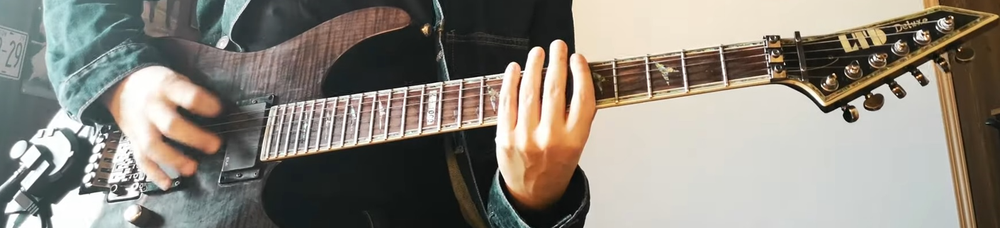
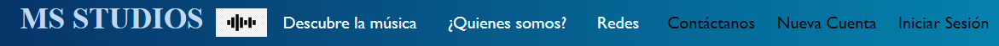
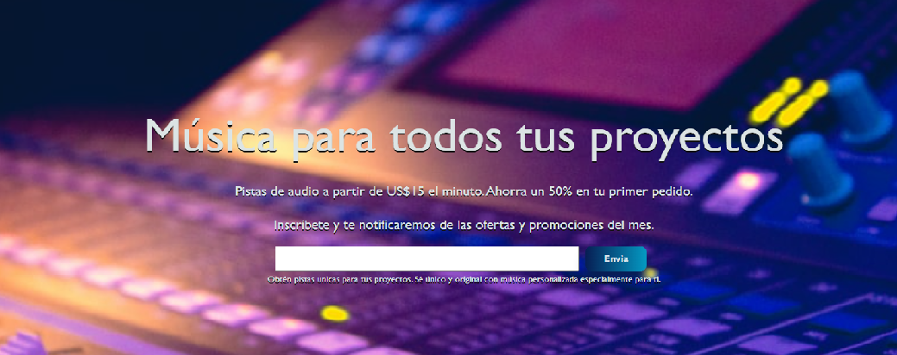
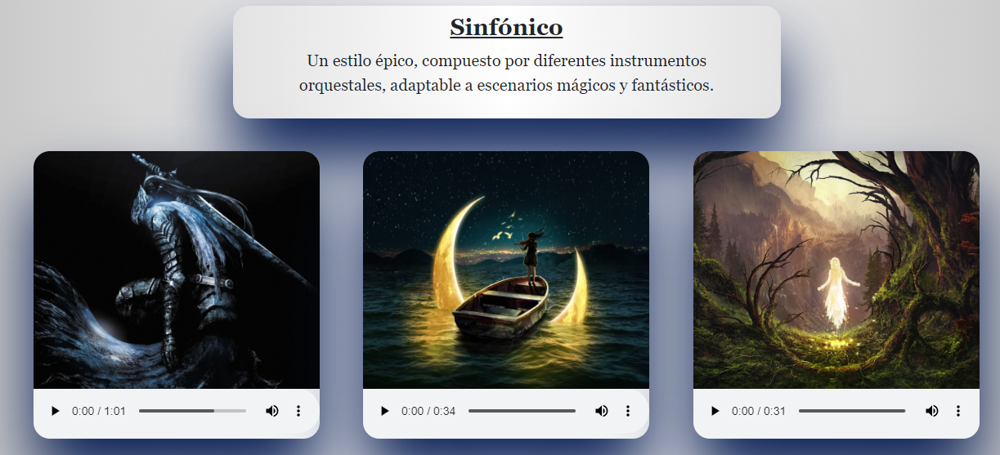
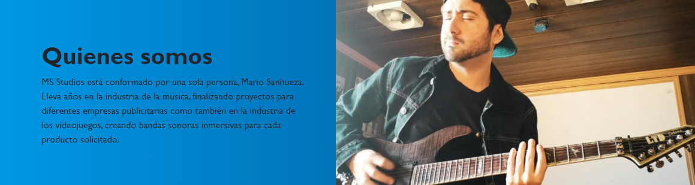
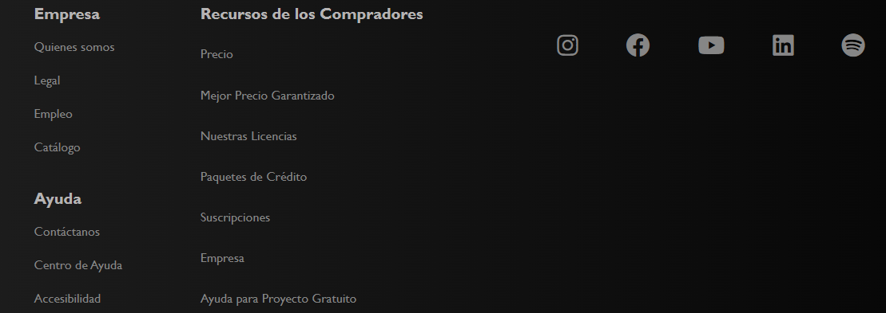

URL hacia Netlify: https://mariolandingpage.netlify.app/

# PROYECTO 1: LandingPage

Primer proyecto del Bootcamp de la UDD "Fullstack" que consiste en crear una landing page promocionando algún producto o servicio.

## Descripción

El proyecto consiste en vender música diseñada especialmente para el cliente solicitante por la empresa independiente MS STUDIOS. Se venderán pistas con estilos de música variados, mostrandose en la página 3 estilos: Sinfónico, Rock (Metal) y Synthwave, con el fin de llamar la atención del cliente con los productos en exposición.

Las canciones que se muestran son creaciones reales hechas por mí y vendidas a clientes, por lo cual, su uso posterior  por otra persona está prohibido, siempre y cuando decida comercializar u obtener ganancias de algún tipo con ellas.

La pagina se divide en 5 secciones:

### NAVBAR

Barra diseñada con boostrap y personalizada con CSS. 
- La parte izquierda consta del nombre de la empresa y su logo.
- La parte central muestra el catálogo (Denotado por "Descubre la música"), quienes somos y redes, cada una lleva a la sección correspondiente en la página.
- En la parte derecha se muestra una sección para iniciar sesión pero no es funcional.

### JUMBOTRON

En esta sección se muestra un título H1 enorme que capta la atención del cliente, especificando que hay música para todos los proyectos del cliente, seguido de una oferta cautivadora y posteriormente, una barra con un encabezado indicando que si se suscribe obtendrá información sobre cuando hayan ofertas y promociones en el mes.

### CATÁLOGO (BLOG)

Aquí se encuentran 3 canciones para 3 estilos musicales diferentes, inscrustadas en columnas diseñadas con Css grid. Las canciones llevan sus controles correspondientes, ya sea para reproducir, detener o manejar el volumen de éstas.

### QUIENES SOMOS

Con una foto a la derecha y una breve descripción de mis servicios, se muestra una sección corta con el fin de entregar mayor información sobre como está conformada la empresa.

### FOOTER

Lugar donde se muestran las secciones de la pagina, en sumayoría no funcionales.
Sin embargo, "Quienes somos", "Catálogo" y "Suscripciones" llevan a las diferentes secciones de la página.
Cabe destacar que los íconos de la parte derecha, hechos por "Font Awesome" llevan a todas mis redes sociales reales.
